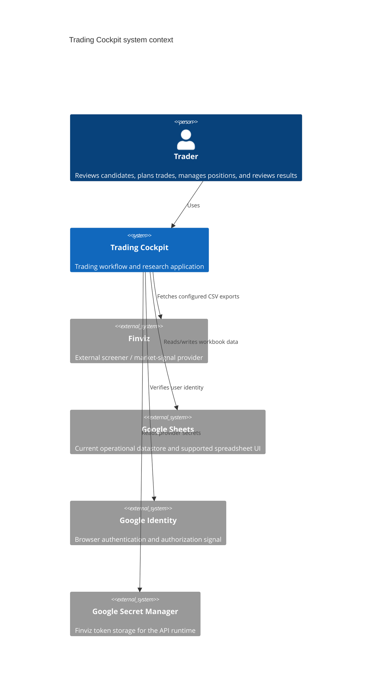
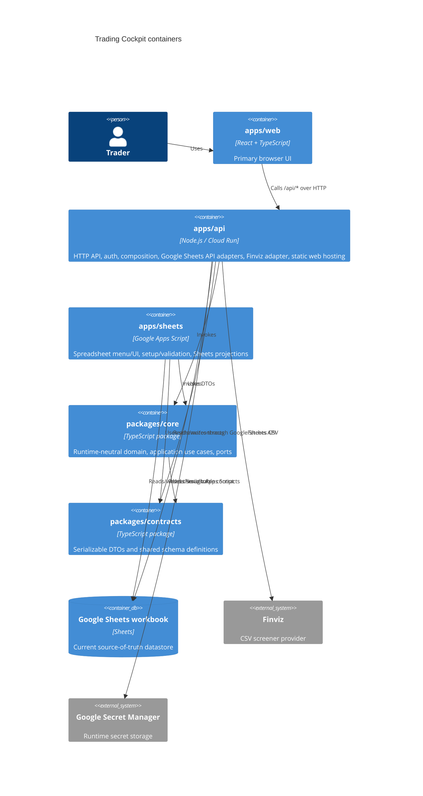
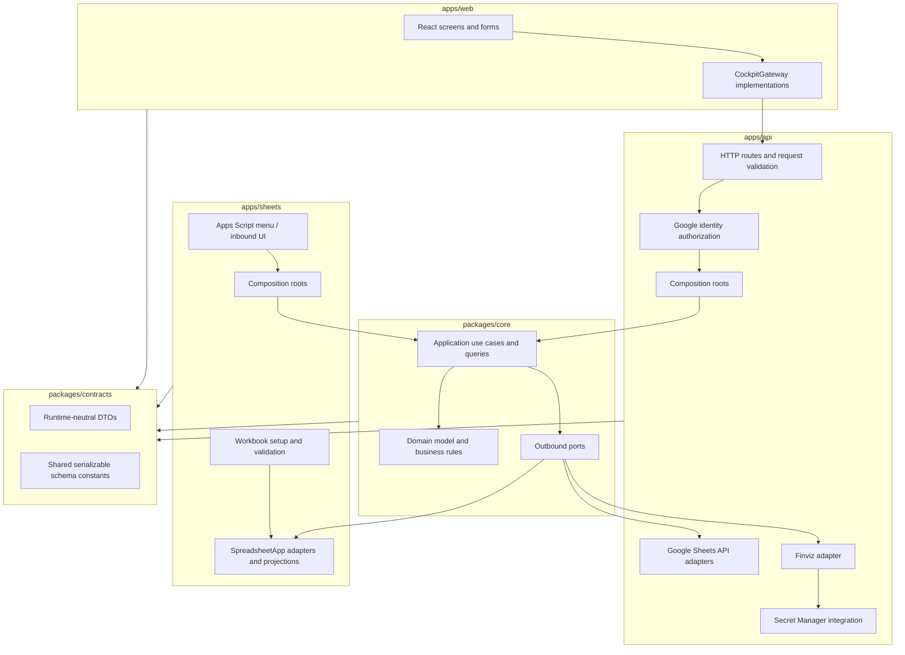

# Trading Cockpit Architecture

This document is the authoritative current architecture description for Trading Cockpit. Historical
decision rationale lives in [ADRs](adr/README.md). Machine-level schemas and behavior remain
authoritative in code and contracts.

## 1. Architecture Overview

Trading Cockpit is a personal trading workflow and research application.

React is the primary operational UI. The production backend is a Node.js HTTP API deployed to Cloud
Run. Google Sheets remains the operational datastore/source of truth for the current version and
also remains a supported Google Sheets UI/admin surface through Apps Script.

The system follows a pragmatic ports-and-adapters architecture:

```text
Inbound adapter
  -> application use case / query
  -> domain model
  -> outbound port
  -> runtime-specific adapter
```

Business behavior belongs in `packages/core`. Runtime-specific concerns such as React, Express,
Google Apps Script, Google Sheets API, SpreadsheetApp, Secret Manager, HTTP transport, toasts, menus,
formulas, and formatting remain in application/adapters.

## 2. C4 Model

### 2.1 System Context



### 2.2 Containers



Shared packages are not deployable applications. They are imported by deployable apps and must not
depend back on those apps.

### 2.3 Components



Level 4/class diagrams are intentionally omitted. Code is the source of truth for individual
classes and functions.

## 3. Repository Structure

```text
apps/
  api/      Node HTTP API, Cloud Run runtime, Google Sheets API adapters, Finviz adapter,
            Google identity authorization, static React hosting
  sheets/   Google Apps Script integration, spreadsheet menu/UI, workbook setup/validation,
            SpreadsheetApp adapters and supported Sheets projections
  web/      React frontend, routing, shadcn/Tailwind presentation, gateway boundary

packages/
  core/      runtime-neutral domain, application use cases/queries, outbound ports
  contracts/ serializable DTOs and shared schema definitions
```

Dependency direction:

```text
apps/web
  -> packages/contracts

apps/api
  -> packages/core
  -> packages/contracts

apps/sheets
  -> packages/core
  -> packages/contracts

packages/core
  -> packages/contracts

packages/contracts
  -> no application dependency
```

Applications depend inward on shared packages. Shared packages must not depend on applications.

## 4. Domain and Application Model

### Strategies

Strategies are Trading Cockpit business concepts. Finviz is only the current market-signal provider.
Momentum Breakout is the currently implemented discovery strategy.

### Accounts

Trading Accounts provide stable identity and risk policy. `ALL` is not a persisted account; it is a
future portfolio/query scope. New Trade Plans, Positions, and Journal entries carry Account ID.

### Watchlist

Watchlist contains human-selected actionable candidates. Active duplicate detection uses Strategy
ID + Strategy Version + Ticker. Closed/rejected entries are terminal for duplicate purposes.

### Trade Plans

A Trade Plan is a single-execution instruction. It snapshots strategy, ticker, account, setup,
planned prices, sizing inputs, and derived planning values. Long plans must satisfy the business
price relationship enforced by the backend before they become executable. React may collect planning
inputs, but backend rules remain authoritative.

### Positions

A Position represents an executed trade for exactly one Trading Account. Position ID is the primary
identity. Planned entry/quantity and actual execution price/quantity are distinct concepts. Current
Price is indicative Google Sheets formula data, not broker execution truth.

### Journal

Journal entries are backend-confirmed closed-trade history. Journal is authoritative for realized
P&L. React renders Journal DTOs but does not mutate historical trade results.

### Capital Ledger

Capital Ledger is append-only external active-trading capital: `INITIAL_FUNDING`, `DEPOSIT`, and
`WITHDRAWAL`. These are not trading P&L. Account realized equity is derived from external capital
plus Journal realized P&L.

### Momentum Discovery

Discovery refreshes Finviz market signals, archives snapshots in Signals History, refreshes
Momentum Ranking, then requires human selection before adding candidates to Watchlist.

## 5. Google Sheets Data Contract V1

Backend DATA sheets and naturally tabular CONFIG sheets use:

- row 1 = stable headers;
- row 2+ = records;
- no title or metadata rows before headers;
- no structural blank rows inside the table;
- no merged cells in data tables;
- one record per row;
- one field per column.

Formatting may improve readability, but presentation must never move the physical table.
Non-empty incompatible schemas are invalid; the system does not silently guess historical layouts.

Canonical workbook inventory:

| Sheet                 |  Classification | Contract                       | Role                                                               |
| --------------------- | --------------: | ------------------------------ | ------------------------------------------------------------------ |
| Momentum Ranking      |            DATA | row 1 headers / row 2+ records | Derived ranked Momentum candidates                                 |
| Watchlist             |            DATA | row 1 headers / row 2+ records | Authoritative selected candidates                                  |
| Trade Plans           |            DATA | row 1 headers / row 2+ records | Authoritative planning workflow                                    |
| Positions             |            DATA | row 1 headers / row 2+ records | Authoritative open/closed position records                         |
| Journal               |            DATA | row 1 headers / row 2+ records | Authoritative closed-trade history                                 |
| Capital Ledger        |            DATA | row 1 headers / row 2+ records | Append-only external capital history                               |
| Signals History       |            DATA | row 1 headers / row 2+ records | Complete historical Finviz snapshots plus Trading Cockpit metadata |
| Strategies            |          CONFIG | row 1 headers / row 2+ records | Strategy reference/configuration                                   |
| Accounts              |          CONFIG | row 1 headers / row 2+ records | Trading account identity and risk policy                           |
| Cockpit Config        |          CONFIG | row 1 headers / row 2+ records | Global settings table; no account capital/risk authority           |
| Momentum Score Config |          CONFIG | row 1 headers / row 2+ records | Human-readable Momentum scoring reference                          |
| Finviz - Momentum     |       TECHNICAL | row 1 headers / row 2+ records | Current Finviz provider projection                                 |
| Documentation         | OPTIONAL_REPORT | generated utility              | Sheets help surface                                                |
| Dashboard             |   LEGACY_UNUSED | none                           | Retired Sheets report; React Dashboard is the supported UI         |
| Analytics             |   LEGACY_UNUSED | none                           | Retired Sheets report; React Analytics is the supported UI         |
| Lists                 |   LEGACY_UNUSED | none                           | Not recreated by canonical setup                                   |
| Finviz Screener       |   LEGACY_UNUSED | none                           | Not recreated by canonical setup                                   |

Physical headers are authoritative in code, especially `packages/contracts` and sheet adapter schema
modules. This document explains the contract for humans.

## 6. Data Flows

Primary workflow:

```text
Finviz
  -> complete provider snapshot
  -> Signals History
  -> Momentum Ranking
  -> Watchlist
  -> Trade Plan
  -> Position
  -> Journal
  -> Analytics / Dashboard
```

Signals History is not merely the subset required by Momentum. It archives every field returned by
the current Finviz CSV export configured and consumed by Trading Cockpit, plus explicit Trading
Cockpit metadata:

```text
Signal Date, Detected At, Strategy ID, Strategy, Strategy Version, Ticker
```

The business `Ticker` identifies the Trading Cockpit signal. The provider CSV field `Ticker` is
archived as `Finviz Ticker` to avoid duplicate headers.

Momentum Ranking is a derived strategy-specific projection. It consumes only the Finviz fields the
Momentum strategy needs and does not redefine Signals History as a Momentum-only store.

## 7. Runtime and Deployment Architecture

Production React flow:

```text
Browser
  -> apps/web static assets served by apps/api
  -> HttpCockpitGateway
  -> apps/api on Cloud Run
  -> packages/core use cases/queries
  -> Google Sheets API / Finviz / Secret Manager
```

React production hosting is not Apps Script HtmlService. Apps Script remains for the supported
Google Sheets UI, workbook setup/validation, menu callbacks, and Sheets projections.

Apps Script flow:

```text
Google Sheets menu
  -> generated Apps Script wrappers
  -> apps/sheets composition
  -> packages/core use cases/queries
  -> SpreadsheetApp adapters
```

Deployment commands and runbooks belong in [operations](operations.md), not here.

## 8. Architectural Constraints

- `packages/core` remains runtime-neutral.
- `packages/contracts` contains serializable contracts and no application dependency.
- Provider integrations are adapters; provider names must not define the domain model.
- Google Sheets schemas are explicit, validated, and adapter-owned.
- DATA/CONFIG schema drift must not be hidden with fallback readers.
- Workbook setup is reproducible and must not invent user-specific business data.
- `apps/api` and `apps/sheets` should reuse `packages/core` behavior instead of duplicating business
  logic.
- React never reads or writes Google Sheets directly and never owns financial/trading calculations.
- Formulas, sheet names, row/column indexes, A1 notation, menus, toasts, formatting, and runtime
  globals stay outside the Core.
- Google Sheets remains the current datastore, not a domain model.
